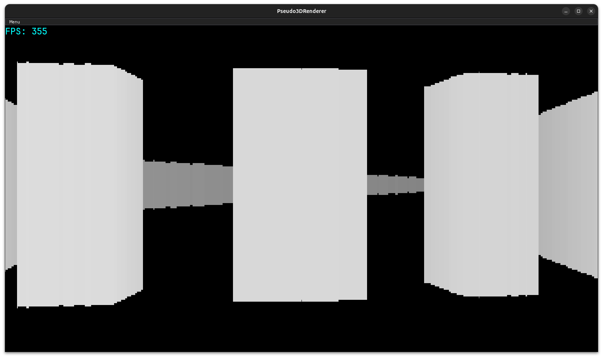
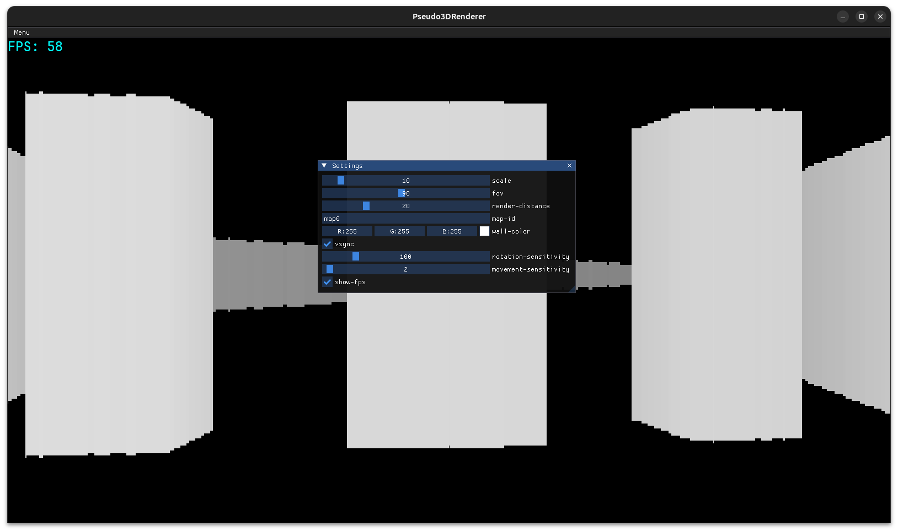
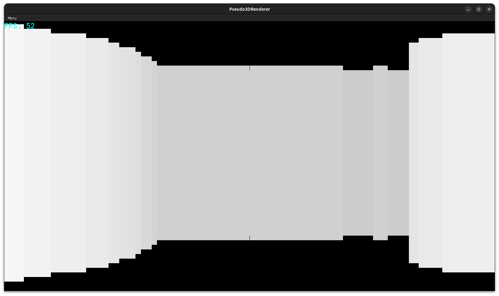
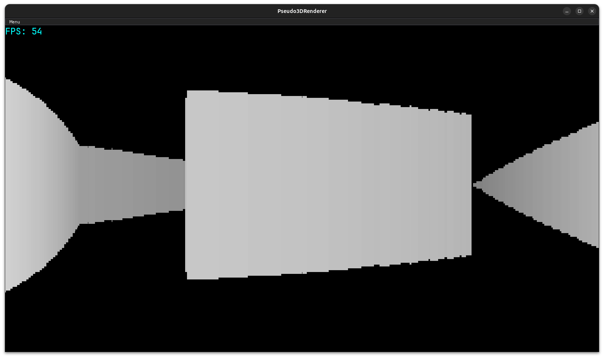

# Pseudo3DRenderer

<p float="left">
  
   
  
  
</p>

A simple pseudo 3D renderer made in C++

## How to run

- Download the latest release
- Unzip it
- Run Pseudo3DRenderer or Pseudo3DRenderer.exe depending on your system

### [Web version](https://semkishow.github.io/Pseudo3DRenderer/)

## How to build

### Executable

1. Install Raylib following one of these tutorials based on your system: [Linux](https://github.com/raysan5/raylib/wiki/Working-on-GNU-Linux), [Windows](https://github.com/raysan5/raylib/wiki/Working-on-Windows), [macOS](https://github.com/raysan5/raylib/wiki/Working-on-macOS)
1. Run 
```
chmod +x run.sh
./run.sh
```

### Web version

1. Install Raylib following one of these tutorials based on your system: [Linux](https://github.com/raysan5/raylib/wiki/Working-on-GNU-Linux), [Windows](https://github.com/raysan5/raylib/wiki/Working-on-Windows), [macOS](https://github.com/raysan5/raylib/wiki/Working-on-macOS)
1. Setup Emscripten using [this tutorial](https://github.com/raysan5/raylib/wiki/Working-for-Web-(HTML5))
1. Run
```
chmod +x run.sh
./run.sh --web
```
